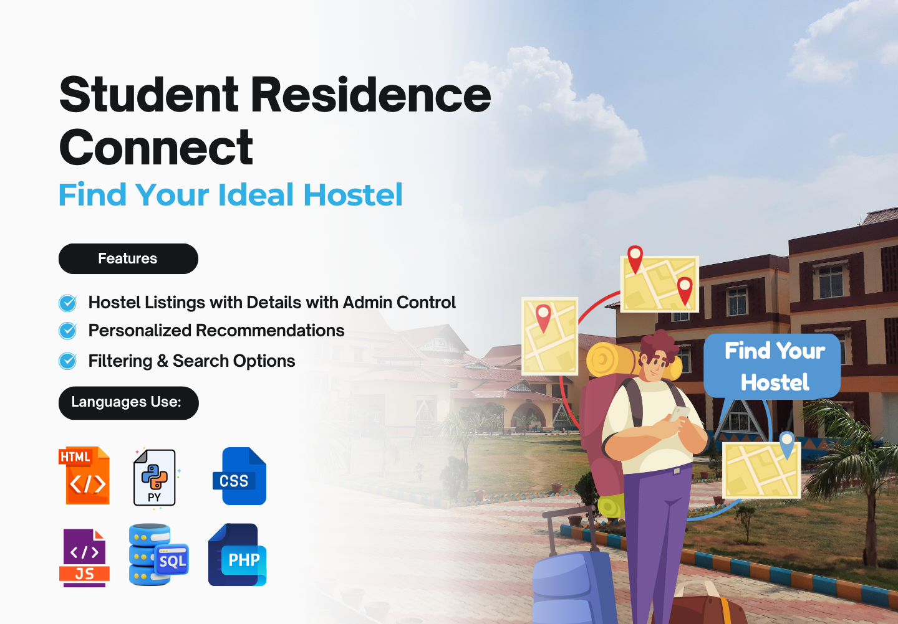
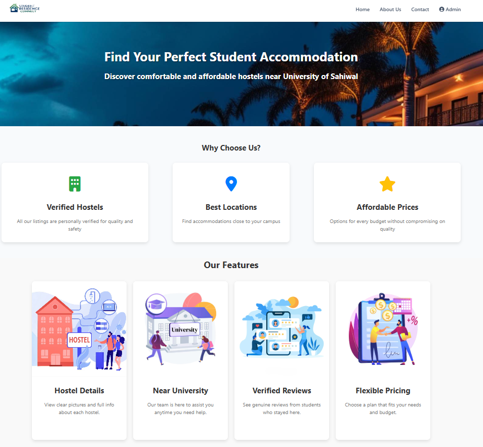
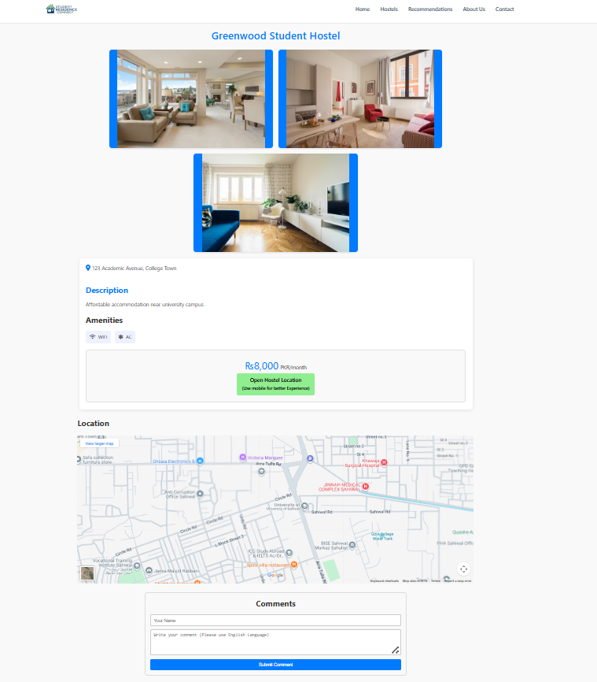

# 🏠 Student Residence Connect
A complete web platform that helps students find hostels near the University of Sahiwal.  
The system includes hostel listings, detailed views, filters, recommendations, sentiment analysis, and an admin panel for managing hostels.

---

## 📸 Project Demo

### **SRC**

### **Home Page**

### **Hostel Listing Page**

### **Hostel Details Page**

### **Recommendation Page**

---

## 🚀 Key Features

### **Hostel Listing Page**
- Displays all hostels near the university  
- Includes filters such as price, location, amenities  
- Clean and responsive design  

### **Hostel Details Page**
- Shows full hostel information  
- Room images, prices, and services  
- Google Maps route link  
- Student comments section  

### **Recommendation System**
- Suggests nearest and most suitable hostels  
- Uses Python and VADER sentiment analysis  
- Considers student reviews stored in MySQL  

### **Admin Panel**
- Add, edit, delete hostels  
- Manage listings easily using PHP and SQL  
- Fully secured with login system  

### **Student Comments & Sentiment Analysis**
- Students post comments  
- Python script (NLTK + VADER) calculates sentiment score  
- Results stored in database and used for recommendations  

---

## 🛠 Technologies Used

### **Frontend**
- HTML  
- CSS  
- JavaScript  

### **Backend**
- PHP  
- Python (for sentiment analysis)  
- MySQL database  

### **Tools & Libraries**
- NLTK + VADER  
- Google Maps directions  
- XAMPP local server  

